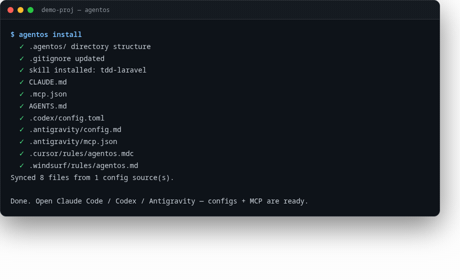

# AgentOS

**Local-first, multi-harness agent operating system. Zero API dependency.**

Ek `agent.config.yaml` → Claude Code, Codex, Antigravity, Cursor, Windsurf — 5 harnesses ke configs, MCP tools, aur shared memory. API ka kharcha zero, har project mein same brain.

> Status: **v0.1.0 — all 4 milestones + Phase 5 shipped** (96 tests green). See `RFC/` for the handoff protocol spec.



## Why

| Aaj | AgentOS |
|---|---|
| Agents har session mein sab bhool jate hain | Persistent local memory (JSON, zero native deps) |
| Har harness ka alag config | Ek YAML → teeno harnesses |
| Search/memory ke liye API tokens | Deterministic local MCP tools |
| Agent switch = context loss | Handoff protocol (Phase 4) |

## Quick Start

```bash
npm install
npm test            # full suite

# in any project:
cd your-project
/path/to/agentos/examples se config copy karo, ya:
node /path/to/agentos/dist/cli.js init

# dev mode:
npx tsx /path/to/agentos/src/cli.ts install
npx tsx /path/to/agentos/src/cli.ts status
```

### agent.config.yaml

```yaml
project:
  name: my-saas
  description: "Laravel API + React dashboard"
stack: [laravel, react]
rules:
  - id: run-tests-first
    text: "Before marking any task done, run the test suite."
  - id: no-any-ts
    harnesses: [claude-code, codex]     # per-harness filtering
    text: "Avoid `any` in TypeScript."
skills:
  - name: tdd-laravel
mcpServers:
  - name: memory
    command: npx
    args: ["tsx", "/abs/path/to/agentos/src/mcp/memory/server.ts"]
```

### Commands

| Command | Karta kya hai |
|---|---|
| `agentos init` | `agent.config.yaml` template banata hai |
| `agentos install` | Configs + `.agentos/` + skills + `.gitignore` setup |
| `agentos sync` | Sab harness configs regenerate (drift par ruk jata hai) |
| `agentos sync --force` | Drift ignore karke overwrite |
| `agentos sync --only codex` | Sirf ek harness sync |
| `agentos status` | Project, harnesses, drift, memory status |
| `agentos mcp memory` | Memory MCP server (stdio — Claude Code/Codex/Antigravity) |

### MCP Tools

**memory** — `memory_store` · `memory_recall` · `memory_get` · `memory_forget` · `memory_topics` · `memory_export` · `memory_stats`
Storage: `<project>/.agentos/memory.json` — local JSON store, atomic writes, markdown exportable.

**supersearch** — `supersearch_text` (regex across project, .gitignore-aware, ripgrep when available) · `supersearch_symbol` (function/class/method definitions via ast-grep) · `supersearch_history` (pickaxe — which commit changed a string) · `supersearch_blame` (per-line authorship)

**codegraph** — `codegraph_impact` (what breaks if I change this file — transitive) · `codegraph_deps` · `codegraph_orphans` (dead code candidates) · `codegraph_cycles` · `codegraph_rebuild` · `codegraph_stats`. Import extraction runs on **tree-sitter (WASM)** — real parsing across TS/JS/Python/PHP/Go/Java/Kotlin, `use function`, multi-line imports, dynamic `import()` — with automatic regex fallback. Zero native deps either way.
Deterministic import-graph (TS/JS, Python, PHP/Laravel, Go, Java/Kotlin), JSON-backed, incremental mtime-based rebuilds.

## Architecture

```
agent.config.yaml (single source of truth)
        │
   ┌────┴─────┬──────────────┐
   ▼          ▼              ▼
CLAUDE.md  AGENTS.md   .antigravity/
.mcp.json  config.toml  mcp.json
   │          │              │
   └────┬─────┴──────────────┘
        ▼
   MCP servers (memory → supersearch → codegraph)
        ▼
   .agentos/memory.json — shared, local, durable
```

## Config Layers (override: local > project > global)

1. `~/.agentos/agent.config.yaml` — global defaults
2. `<project>/agent.config.yaml` — committed, shared
3. `<project>/agent.config.local.yaml` — gitignored, personal

## Roadmap

- [x] Phase 1: config schema, harness generators, drift detection, memory MCP
- [x] Phase 2: supersearch (text/symbol/git) + codegraph (impact/orphans/cycles) MCP servers
- [x] Phase 3: skills framework + 10 core skills
- [x] Phase 4: handoff protocol (RFC + bundle + auto-inject) + doctor
- [x] Phase 5: Cursor + Windsurf targets, `agentos learn` (git-history rule suggestions)
- [x] VS Code extension (`editors/vscode/`) — status-bar doctor, skills sidebar, handoff wizard, `--json` CLI output (Issue #2)
- [x] tree-sitter codegraph (Issue #4) — WASM parsing backend + lower-case PHP namespace resolution
- [x] GitHub Actions CI — test matrix (Node 20/22) + extension compile

## Editor Integrations

### VS Code (`editors/vscode/`)

Status-bar doctor (refreshed on save), skills sidebar with one-click install, sync/status/doctor commands, and a guided handoff wizard — all through the local CLI, zero API dependency.

```bash
cd editors/vscode && npm install && npm run compile   # F5 to debug
```

All CLI commands support `--json` for machine-readable output (`status`, `doctor`, `skill list`) — use it for your own editor/tooling integrations.

## Handoff Protocol

Switch agents mid-task with zero re-explaining:

```bash
agentos handoff --to codex --task "Invoice PDF export half-done: queue job done, blade template missing" \
  --files "app/Jobs/GenerateInvoicePdf.php" --decisions "queue vs sync pending"
agentos sync   # HANDOFF.md auto-injected into all 5 harness configs
```

The receiving agent gets: task state, files in progress, pending decisions, open questions, memory snapshot, git state. Spec: `RFC/handoff-protocol.md`.

## Storage

Zero native dependencies — `npm install` never compiles anything. Memory and graph persist as atomic-writes JSON in `.agentos/`. A SQLite backend can plug in behind the same interface later if a project outgrows it.

## License

MIT
