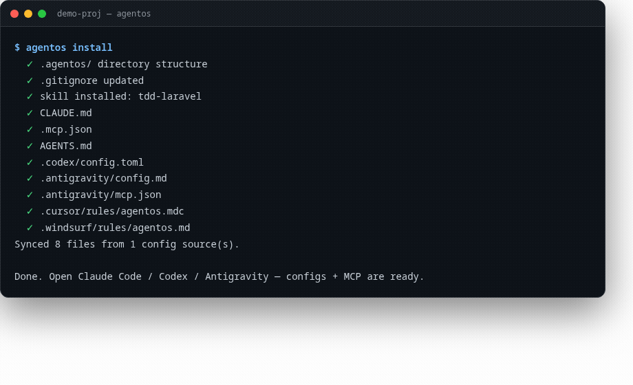

# AgentOS

**Local-first, multi-harness agent operating system. Zero API dependency.**

Ek `agent.config.yaml` → Claude Code, Codex, Antigravity, Cursor, Windsurf — 5 harnesses ke configs, MCP tools, aur shared memory. API ka kharcha zero, har project mein same brain.

> Status: **v0.2.2** — all 4 milestones + Phase 5 shipped, two full audit rounds (see CHANGELOG.md), CI green on Linux + Windows. See `RFC/` for the handoff protocol spec.



## Why

| Aaj | AgentOS |
|---|---|
| Agents har session mein sab bhool jate hain | Persistent local memory (JSON, zero native deps) |
| Har harness ka alag config | Ek YAML → paanch harnesses |
| Search/memory ke liye API tokens | Deterministic local MCP tools |
| Agent switch = context loss | Handoff protocol (Phase 4) |

## Quick Start

```bash
npm install -g @basit0090/agent-os

# in any project:
cd your-project
agentos init        # creates agent.config.yaml
agentos install     # configs + MCP servers for all 5 harnesses
agentos doctor      # health check
```

Building a SaaS? `agentos init --saas` writes a stricter template instead of the plain one. It detects the stack from the current folder — `composer.json` → Laravel, a `package.json` that depends on `next` → Next.js, otherwise Node — and fills in that stack's `verify` commands (`php artisan test` / `npm test` + `npx tsc --noEmit`) and skills (`saas-builder`, `ponytail`, plus `tdd-laravel` or `tdd-react`). On top of the usual template it adds nine guardrail rules (plan before data-model/auth/money/infra changes, prove with test output, never weaken a test, honest closing report, secrets only in `.env.example`, ask before adding a dependency, validation + authorization + tests on every endpoint, DB changes only via migrations, record hard-to-reverse decisions) and an `orchestrator` block with the six built-in risk rules written out, so `agentos run` is ready to use. It also creates `docs/decisions/README.md` (never overwriting an existing one) describing the decision-record format. The detected stack is printed; plain `agentos init` is unchanged.

From source: `npm install && npm test`, dev CLI: `npx tsx src/cli.ts <cmd>`.

### Upgrading

`agentos sync` pins the MCP servers it writes to its own version (`npx -y @basit0090/agent-os@0.2.2 mcp memory`) — npx caches an unversioned spec and would keep running whichever version it fetched first. So after a new release:

```bash
npm install -g @basit0090/agent-os@latest   # or run it once: npx -y @basit0090/agent-os@latest sync
agentos sync                                # rewrites .mcp.json, .codex/config.toml, … with the new version
agentos doctor                              # "mcp:version" warns if a generated config still runs another version
```

Then restart the harness (or reconnect its MCP servers) so it starts the new version.

Adopting agentos in a project that already has a `CLAUDE.md` / `AGENTS.md`? `install` refuses to overwrite them — move their content into `agent.config.yaml`, then `agentos install --force` (the originals are kept as `<file>.bak`).

### agent.config.yaml

```yaml
project:
  name: my-saas
  description: "Laravel API + React dashboard"
stack: [laravel, react]
rules:
  - id: run-tests-first
    text: "Before marking any task done, run the test suite."
  - id: no-any-ts
    harnesses: [claude-code, codex]     # per-harness filtering
    text: "Avoid `any` in TypeScript."
skills:
  - name: tdd-laravel
mcpServers:                            # what `agentos init` generates
  - name: memory
    command: npx
    args: ["-y", "@basit0090/agent-os", "mcp", "memory"]   # sync writes @basit0090/agent-os@<its version>
  - name: supersearch
    command: npx
    args: ["-y", "@basit0090/agent-os", "mcp", "supersearch"]
  - name: codegraph
    command: npx
    args: ["-y", "@basit0090/agent-os", "mcp", "codegraph"]
staleAfter:                            # optional — when doctor/sync call context stale (defaults shown)
  handoffDays: 3                       # HANDOFF.md older than this
  handoffCommits: 20                   # HEAD moved more than this past the handoff's commit
  pinnedFactDays: 14                   # a pinned memory fact not updated for this long
```

Leave the version out of `agent.config.yaml`: `sync` pins the servers to the CLI that runs it. A version you do write there (`@basit0090/agent-os@0.2.1`) is kept as written.

### Commands

| Command | Karta kya hai |
|---|---|
| `agentos init` | `agent.config.yaml` template banata hai |
| `agentos init --saas` | SaaS template — stack detect (Laravel / Next.js / Node), guardrail rules, `orchestrator` + `docs/decisions/` |
| `agentos install` | Configs + `.agentos/` + skills + `.gitignore` setup |
| `agentos sync` | Sab harness configs regenerate (drift par ruk jata hai) |
| `agentos sync --force` | Drifted / pehle se maujood files overwrite (purani copy `<file>.bak`) |
| `agentos sync --only codex` | Sirf ek harness sync (baqi ka drift tracking barqarar) |
| `agentos status [--json]` | Project, harnesses, drift, memory status |
| `agentos doctor [--json]` | Health check — config, harness files, drift, MCP commands + pinned version, memory (stale pinned facts), skills, handoff freshness, Codex trust |
| `agentos skill list \| install \| search \| test` | Skills — bundled, registry, `owner/repo[#dir]`, git URL, ya local path |
| `agentos handoff --to <harness> --task "..."` | Context bundle export (task, decisions, memory, git) |
| `agentos handoff --clear` | Kaam khatam: `HANDOFF.md` hatao (bundle `.agentos/handoffs/` mein rehta hai), phir `agentos sync` |
| `agentos learn [--apply]` | Git history se rule suggestions |
| `agentos ui [--port <n>] [--no-open]` | Local dashboard (default port `4455`; `--no-open` browser nahi kholta) |
| `agentos mcp memory \| supersearch \| codegraph` | MCP servers (stdio — har harness ke liye) |

### MCP Tools

**memory** — `memory_store` · `memory_recall` · `memory_get` · `memory_forget` · `memory_topics` · `memory_export` · `memory_stats`
Storage: `<project>/.agentos/memory.json` — local JSON store, atomic writes, markdown exportable.

**supersearch** — `supersearch_symbol` (function/class/method definitions via ast-grep) · `supersearch_history` (pickaxe — which commit changed a string) · `supersearch_blame` (per-line authorship) · `supersearch_text` (regex across project, .gitignore-aware — for harnesses without a built-in grep; in Claude Code the built-in Grep is cheaper, see `bench/RESULTS.md`)

**codegraph** — `codegraph_impact` (what breaks if I change this file — transitive) · `codegraph_deps` · `codegraph_orphans` (dead code candidates) · `codegraph_cycles` · `codegraph_rebuild` · `codegraph_stats`. Import extraction runs on **tree-sitter (WASM)** — real parsing across TS/JS/Python/PHP/Go/Java/Kotlin, `use function`, multi-line imports, dynamic `import()` — with automatic regex fallback. Zero native deps either way.
Deterministic import-graph (TS/JS, Python, PHP/Laravel, Go, Java/Kotlin), JSON-backed, incremental mtime-based rebuilds.

## Architecture

```
agent.config.yaml (single source of truth)
        │
   ┌────┼──────────┬─────────────┬──────────┬──────────┐
   ▼    ▼          ▼             ▼          ▼          ▼
CLAUDE.md      AGENTS.md    Antigravity   .cursor/   .windsurf/
.mcp.json   .codex/config.toml  rules+mcp   rules/     rules/
   │           │               │            │          │
   └───────────┴───────┬───────┴────────────┴──────────┘
                       ▼
   MCP servers (memory → supersearch → codegraph)
                       ▼
   .agentos/memory.json — shared, local, durable (safe with several harnesses open at once)
```

## Harness Notes

| Harness | Generated | Note |
|---|---|---|
| Claude Code | `CLAUDE.md`, `.mcp.json` | Project-scoped MCP servers; Claude asks once before enabling them. |
| Codex | `AGENTS.md`, `.codex/config.toml` | Codex only reads a project's `.codex/config.toml` when the project is **trusted** (answer the trust prompt, or set `trust_level = "trusted"` for it in `~/.codex/config.toml`). `agentos doctor` warns when the trust entry is missing — it never writes it; trust is your call. Servers get `startup_timeout_sec = 120` — the first `npx -y` run downloads the package. |
| Antigravity | `.agents/rules/agentos.md`, `.agents/mcp_config.json` | Rule has `trigger: always_on` frontmatter, as Antigravity requires. |
| Cursor | `.cursor/rules/agentos.mdc`, `.cursor/mcp.json` | `alwaysApply: true`. |
| Windsurf | `.windsurf/rules/agentos.md` | `trigger: always_on` frontmatter (without it a rule is manual-only). Windsurf has **no project-level MCP file**: add the servers from `.mcp.json` to Windsurf's global `mcp_config.json` yourself. |

Cursor, Windsurf and Antigravity also read `AGENTS.md`, so with `codex` among the targets they see the rules twice. If that matters, sync only what you use: `agentos sync --only claude-code,cursor`.

The MCP servers find the project by walking up from their working directory to `agent.config.yaml`; set `AGENTOS_PROJECT=/abs/path` in a server's `env` to pin it. `env` values in `mcpServers` are written into the generated MCP files — keep secrets out of them (sync warns when they come from `agent.config.local.yaml`).

Re-running `agentos install` leaves already-installed skills alone (your edits survive); `agentos skill install <name>` or `install --force` refreshes them. Installed copies omit the skill's `test/` directory so your own test runner doesn't pick it up.

## Config Layers (override: local > project > global)

1. `~/.agentos/agent.config.yaml` — global defaults
2. `<project>/agent.config.yaml` — committed, shared
3. `<project>/agent.config.local.yaml` — gitignored, personal

## Roadmap

- [x] Phase 1: config schema, harness generators, drift detection, memory MCP
- [x] Phase 2: supersearch (text/symbol/git) + codegraph (impact/orphans/cycles) MCP servers
- [x] Phase 3: skills framework + 13 core skills
- [x] Phase 4: handoff protocol (RFC + bundle + auto-inject) + doctor
- [x] Phase 5: Cursor + Windsurf targets, `agentos learn` (git-history rule suggestions)
- [x] VS Code extension (`editors/vscode/`) — status-bar doctor, skills sidebar, handoff wizard, `--json` CLI output (Issue #2)
- [x] tree-sitter codegraph (Issue #4) — WASM parsing backend + lower-case PHP namespace resolution
- [x] GitHub Actions CI — Linux + Windows test matrix (Node 20/22), global-install and git-install smoke tests, extension compile

## Community Skill Registry (Issue #3)

Skills are just directories — `SKILL.md` + `test/`. Install from **any git source**, no API keys:

```bash
agentos skill install owner/repo             # GitHub shorthand — every SKILL.md in the repo (up to 3 levels deep)
agentos skill install owner/repo#skills/foo  # one directory inside the repo
agentos skill install https://gitlab.com/team/skills.git
agentos skill install ./my-skills/foo        # a local directory
agentos skill install android-testing        # a registry name → resolved to repo + path
agentos skill search deploy                  # bundled + registry search
```

Or declare them in `agent.config.yaml` and let `agentos install` fetch them:

```yaml
skills:
  - name: tdd-laravel                          # bundled
  - name: deploy-checklist
    source: team/agent-skills#skills/deploy-checklist
```

Point `skillRegistry` at an index JSON to search a community registry:

```yaml
skillRegistry: https://raw.githubusercontent.com/abtrader00900/agentos/master/skills/registry.json
```

Index format: `{ "version": 1, "skills": [{ "name", "description", "repo", "path?" }] }`.
The bundled `saas-builder` skill is agentos's own playbook for turning an app into a sellable SaaS: ground rules every agent follows, 15 layers in build order (each with what agents miss, what the owner decides, and a "done when" list), and a pre-launch checklist. Install it with `agentos skill install saas-builder` and paste a layer's "done when" list into an `agentos run` task as its acceptance criteria.

The bundled `ponytail` skill (a YAGNI ladder that keeps agent diffs small) comes from [DietrichGebert/ponytail](https://github.com/DietrichGebert/ponytail) under the MIT license; its license ships in `skills/ponytail/LICENSE`.

Every install is validated (frontmatter `name`/`description` with a "Use when" trigger, at least two `##` sections, a `test/` directory) before it lands in `.agentos/skills/`; `agentos skill test` checks the bundled and the installed skills.

## Editor Integrations

### VS Code (`editors/vscode/`)

Status-bar doctor (refreshed on save), skills sidebar with one-click install, sync/status/doctor commands, and a guided handoff wizard — all through the local CLI, zero API dependency.

```bash
cd editors/vscode && npm install && npm run compile   # F5 to debug
```

All CLI commands support `--json` for machine-readable output (`status`, `doctor`, `skill list`) — use it for your own editor/tooling integrations.

## Handoff Protocol

Switch agents mid-task with zero re-explaining:

```bash
agentos handoff --to codex --task "Invoice PDF export half-done: queue job done, blade template missing" \
  --file app/Jobs/GenerateInvoicePdf.php \
  --decision "queue vs sync, pending" \
  --question "Should the refund hit the same ledger entry, or a new one?"
agentos sync   # HANDOFF.md auto-injected into all 5 harness configs

# work finished:
agentos handoff --clear && agentos sync
```

`--file`, `--decision` and `--question` repeat, one item each. The list forms still work: `--files a.ts,b.ts` splits on `,` or `;`; `--decisions` and `--questions` split on `;` or newlines only, so a sentence with commas stays one item (before 0.2.2 they split on every comma).

The receiving agent gets: task state, files in progress, pending decisions, open questions, memory snapshot (each fact with its last-updated date), git state. `doctor` and `sync` warn once the handoff is older than 3 days or HEAD moved more than 20 commits past it (`staleAfter`). Spec: `RFC/handoff-protocol.md`.

## `agentos run` — hand a task to the agent team

Add an `orchestrator` block to `agent.config.yaml`:

```yaml
orchestrator:
  verify: [npm test, npx tsc --noEmit]   # must pass before a PR opens
  build: [npm run compile]               # refresh committed build output just before the PR
  workers: [claude, codex]               # agent CLIs that write code — your subscriptions, no API keys
  reviewer: codex                        # reviews the diff (swapped if it wrote everything)
  maxWorkers: 2                          # parallel agents, each in its own git worktree
  link: [node_modules]                   # installed deps shared from your checkout into worktrees
  models: { codex: gpt-5.6-sol }         # optional: override a CLI's default model
```

```bash
agentos run "add a discount field to customers"   # plan → parallel agents → tests + review → PR
agentos run --quick "fix the typo in the footer"    # small task: no planner, one agent does it all
agentos runs                                        # list runs
agentos run --resume <id>                           # continue after a rate limit or a crash
agentos run --cancel <id>
```

The `build` commands run in the run worktree right before the PR and their output is committed as `agentos: build`, so generated files you keep in git go out with the change; a failing build command stops the run with that command's output instead of opening a PR.

The tests and the cross-model review run at the same time, so a fix round gets failing checks and review findings together. After a fix round the reviewer sees only the fixer's change, checked against its earlier findings; a full review runs again whenever the base branch is merged in.

A run ends with a pull request, or with a reason it needs you. It never pushes your default branch or deploys. It never uses the agents' skip-permission flags. It blocks the PR when any commit in the run adds a secret, even one a later fix removed. Run state and logs are kept in `.agentos/runs/<id>/`.

### Smart gates

Before a PR opens, agentos checks the change itself and tells you where it needs a human.

**Risky files.** The diff is matched against risk rules. By default they only flag: migrations and `.sql`, CI and deploy files (`.github/workflows/**`, `Dockerfile`, `docker-compose*.yml`, `railway.*`, `Procfile`, `vercel.json`), lockfiles, auth, policies, middleware and permissions, `.env.example` and `config/**`, and any change deleting 200 lines or more. A flagged run leads its PR body with **⚠️ Look here** and the files, and shows up under "Needs you" in the dashboard with a ⚠️ next to its status.

Set your own rules with `orchestrator.risk` — it replaces the built-in list. A rule takes exactly one of `paths` or `deletedLines`, and `action: block` stops the run at `needs_human` instead of opening a PR:

```yaml
orchestrator:
  risk:
    - { name: migration, action: block, paths: ["**/migrations/**", "**/*.sql"] }
    - { name: lockfile, action: flag, paths: [package-lock.json] }
    - { name: big-delete, action: flag, deletedLines: 200 }
```

`**` crosses folders, `*` and `?` stay inside one, and a pattern without a slash matches that name at any depth.

**Weakened tests.** The diff is scanned for tests made to pass rather than made to work: a new `it.skip`/`.only`/`xit`, `markTestSkipped`, `@pytest.mark.skip`, `t.Skip`, `@Ignore`, a deleted test file, or fewer assertions than before. A skipped or deleted test is a high finding and a thinner one is medium, so both go to the fixer — unless the task itself asked for it ("remove the old login test"), in which case they drop to low and only appear as a note in the PR. The reviewer is told to look for the same thing in prose.

**The agents' own account.** Every worker and fixer ends with a four-line report — `CHANGED`, `NOT DONE`, `ASSUMED`, `NOT VERIFIED`. It goes to the reviewer, which checks each claim against the diff, and into the PR body under "What the agents report", so what was left out, assumed or never run is written down instead of implied. An agent that gives no report is listed as "no report"; that alone never blocks a PR.

To hand work over from inside a Claude Code or Codex chat, register the MCP server and call `run_task`:

```yaml
mcpServers:
  - name: orchestrator
    command: npx
    args: ["-y", "@basit0090/agent-os@0.3.0", "mcp", "orchestrator"]
```

### Local decider (optional, jevos)

A small yes/no model, [jevos](https://github.com/feder-cr/jev), can run on your own machine and make two calls during a run:

- **auto-quick** — when it is sure a task is a single focused change, the run skips the planner (the PR body says so). An explicit `--quick` or `--plan`, or a CI fix, is never second-guessed.
- **content flags** — it reads the added lines of the diff and adds ⚠️ `jevos:money`, `jevos:data-loss` or `jevos:access` risk flags with their percentage.

It only ever adds. It never blocks a run and never removes a check. When it is not installed, not running, slow (> 3 s) or answers nonsense, the run continues exactly as without it and logs one skipped `decider` event. Nothing leaves your machine: the URL must be a loopback address.

```bash
agentos decider install     # asks first, then downloads about 650 MB (--yes skips the question, --force reinstalls)
agentos decider start       # starts jev serve on the configured loopback host with a fresh API key (--force starts on little free memory)
agentos decider status      # installed? running? free memory
agentos decider stop        # stops it — only a jevos that answers /health on that URL is ever killed
```

The download takes the binary for your platform (windows-x64, linux-x64, macos-arm64) plus the model, and checks every file against the release's `SHA256SUMS.txt`; a mismatch leaves nothing installed. Everything lands in `~/.agentos/jevos`. jevos needs about 1–1.4 GB of memory, so `start` refuses below 1200 MB free unless you pass `--force`.

Settings (the whole block is optional; these are the defaults):

```yaml
decider:
  autoQuick: true                # let it choose --quick
  contentRisk: true              # let it add content risk flags
  quickAbove: 0.8                # P(yes) at or above this skips the planner
  riskAbove: 0.6                 # P(yes) at or above this adds a ⚠️ flag
  url: http://127.0.0.1:8017     # must be loopback: 127.0.0.1, localhost or [::1]
```

`agentos doctor` reports whether jevos is installed.

## 24/7: `agentos daemon`

The daemon keeps agentos working while you are away: it fires the schedules you set, fixes failed CI on agentos's own pull requests, and runs the jobs you queue — one at a time, within a daily cap. Every job still ends at a pull request; nothing merges, deploys or pushes your default branch.

Turn it on per project in `agent.config.yaml` (a project without this block is ignored, registered or not):

```yaml
daemon:
  enabled: true            # without this the daemon ignores the project
  ciFix: true              # watch this project's agentos/run-* PRs and fix failed CI
  schedules:
    - cron: "0 2 * * *"    # 02:00 every night, local time (5-field cron)
      task: "update dependencies' patch versions and keep npm test green"
      quick: false
```

```bash
agentos daemon start                      # spawn the loop in the background; it logs to ~/.agentos/daemon.log
agentos daemon status                     # running? last tick, runs today, the log path
agentos daemon stop                       # stops the loop; a run in flight keeps going and the next start adopts it
agentos daemon install                    # Windows: a script in your Startup folder starts it at logon, no admin needed (uninstall removes it)
agentos daemon run                        # the loop in the foreground (what start and the logon task run)

agentos queue add "add a discount field"  # queue a job for the project in this folder (--project, --quick)
agentos queue list                        # the last 50 jobs, newest first (--json)
agentos queue remove <id>                 # only a job that has not started
```

The machine-wide limits live in `~/.agentos/daemon.yaml` (the file is optional; these are the defaults):

```yaml
maxRunsPerDay: 6           # jobs started per local calendar day; a resumed job does not count again
maxCiFixesPerPr: 2         # fix rounds the daemon spends on one pull request
tickSeconds: 30            # how often it checks schedules and the queue
ciEverySeconds: 300        # how often it asks gh for failed checks
pauseMinutesOnLimit: 30    # how long the queue waits after a rate limit
```

A job also waits while another run is in flight or free RAM is below the project's `orchestrator.minFreeMemoryMb`.

CI fixes work on the pull request they fix: the daemon pushes to that `agentos/run-*` branch only, only as a fast-forward, and opens no second PR. CI log text reaches the agent as quoted, redacted data, never as instructions.

The daemon does nothing while the machine sleeps; a missed schedule fires once on wake. On Windows, `agentos doctor` warns when the AC sleep timeout is not "Never".

Billing: the daemon runs the same agent CLIs you run by hand, so `claude -p` draws from your Claude subscription's usage limits — see Anthropic's "Use the Claude Agent SDK with your Claude plan" (June 2026). The daily cap exists to leave quota for your interactive work.

## Learning from runs

After every `agentos run`, agentos records what went wrong and how it was fixed: failing checks that a fix round turned green, review findings that were fixed, CLI fallbacks and merge conflicts. A read-only agent turns that into up to three short lessons. Later runs get the relevant lessons in their planner, worker, reviewer and fixer prompts. Your normal Claude and Codex chats see them too, through `memory_recall`.

- A lesson backed by that recorded evidence is used right away (`auto`).
- A guess, or anything with a URL or a shell pipe, waits for you (`pending`).
- A lesson that contains a secret is dropped.
- A lesson whose text is edited outside agentos (for example with `memory_store`) drops back to `pending` until you approve it again.

```bash
agentos lessons                      # list (status, seen, used) with each lesson's evidence
agentos lessons --pending            # waiting for you
agentos lessons approve <key>        # or: forget <key> | promote <key> (auto/approved only → agent.config.local.yaml rule)
agentos skill drafts                 # a skill drafted after a kind of task succeeded 3 times
agentos skill approve <kind>         # prints it, then installs it; or: agentos skill reject <kind>
agentos learn --pending-runs         # learn from finished runs that were not learned yet
```

A rejected draft, or one that failed validation or the safety filter, leaves a tombstone, so agentos drafts that kind at most once. Delete `.agentos/skill-drafts/<kind>/` to allow a new draft.

```yaml
learning:            # optional; these are the defaults
  retro: true
  retroAgent: claude
  maxLessonsInPrompt: 5
  skillAfterRuns: 3
```

## Dashboard

Start the local dashboard with:

```bash
agentos ui [--port <n>] [--no-open]
```

The default port is `4455`; `--no-open` keeps the browser closed. The command prints `agentos dashboard: http://127.0.0.1:<port>/?t=<token>`, where the token is a fresh random 32-byte hex value for each `agentos ui` process. Opening that URL sets an `HttpOnly; SameSite=Strict` cookie and redirects to `/`. After that, every page and API request needs the cookie; scripts can use the token as a Bearer token instead. Token comparison is constant-time.

The server listens only on `127.0.0.1`. Its `Host` header must be `127.0.0.1:<port>` or `localhost:<port>`, which blocks DNS rebinding. `POST` and `DELETE` requests also need a matching `Origin` and `application/json`, and request bodies are capped at 16 KB. Static files come only from the packaged `ui/` folder. The frontend never builds HTML from strings (no `innerHTML`) and uses no inline scripts or styles. Its CSP is `default-src 'self'; script-src 'self'; style-src 'self'; img-src 'self' data:; connect-src 'self'; frame-ancestors 'none'; base-uri 'none'; form-action 'self'`.

Projects come from `~/.agentos/projects.json`; every `agentos run` registers its project there. A folder that no longer exists is marked `missing` and can be removed from the list without touching the folder itself.

- **All projects:** one card per project with running, needs-you, pending lessons, skill drafts, and the week's runs, PRs and cost, plus a "Needs you" list.
- **Runs:** task, status, fix rounds, cost and age, newest first; it refreshes automatically while a run is active.
- **Run detail:** status, fix round, elapsed time, cost and agents; Cancel while running or Resume when possible; stage bar, subtasks, last verify result, review findings, lessons used and PR link; live SSE events with a "Show agent output" toggle, plus "Show diff".
- **Lessons:** pending lessons first with Approve and Forget, safety-held lessons marked, then active lessons with Promote and Forget.
- **Skill drafts:** kind, description and full `SKILL.md`, with Approve and Reject.
- **New run:** task box, preflight problems and Start run; starting opens the run detail page.

Runs are detached processes. Closing the dashboard or stopping `agentos ui` does not stop a run; reopen the dashboard and the run is still there.

## Storage

Zero native dependencies — `npm install` never compiles anything. Memory and graph persist as atomic-writes JSON in `.agentos/`. A SQLite backend can plug in behind the same interface later if a project outgrows it.

## License

MIT
